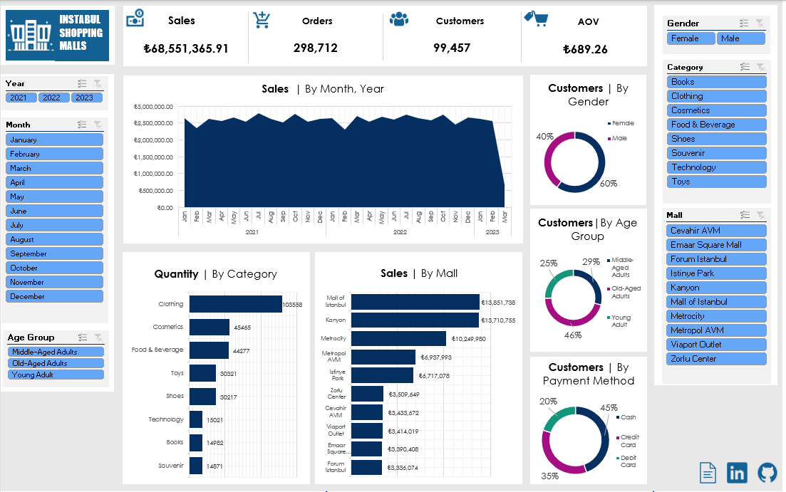

# Customer Shopping Analysis
This is an exploratory data analysis on shopping data across malls in Instabul gotten from kaggle. More information and the data can be downloaded from [here](https://www.kaggle.com/datasets/mehmettahiraslan/customer-shopping-dataset).

## Introduction
Welcome to the shopping world of Istanbul! Our dataset contains shopping information from 10 different shopping malls between 2021 and 2023. We have gathered data from various age groups and genders to provide a comprehensive view of shopping habits in Istanbul. The dataset includes essential information such as invoice numbers, customer IDs, age, gender, payment methods, product categories, quantity, price, order dates, and shopping mall locations. We hope that this dataset will serve as a valuable resource for researchers, data analysts, and machine learning enthusiasts who want to gain insights into shopping trends and patterns in Istanbul. Explore the dataset and discover the fascinating world of Istanbul shopping!

### Data
Attribute Information:

- invoice_no: Invoice number. Nominal. A combination of the letter 'I' and a 6-digit integer uniquely assigned to each operation.
- customer_id: Customer number. Nominal. A combination of the letter 'C' and a 6-digit integer uniquely assigned to each operation.
- gender: String variable of the customer's gender.
- age: Positive Integer variable of the customers age.
- category: String variable of the category of the purchased product.
- quantity: The quantities of each product (item) per transaction. Numeric.
- price: Unit price. Numeric. Product price per unit in Turkish Liras (TL).
- payment_method: String variable of the payment method (cash, credit card or debit card) used for the transaction.
- invoice_date: Invoice date. The day when a transaction was generated.
- shopping_mall: String variable of the name of the shopping mall where the transaction was made.

## Data Inspection and Cleaning
Upon inspection of the dataset, the following are the observations and data cleaning processes carried out on each column;
1. There were 99,458 transactions made with no duplicate records found.
2. Every invoice_no and customer_id record was unique.
3. Gender column only consisted of male and female entries.
4. Age of customers ranged from 18-69.
5. There were 8 product categories which are books,clothing, cosmetics, food & beverages, shoes, souvenir, technology and toys.
6. Quantity and Price were both positive numeric columns.
7. Payment method consists of cash,credit card or debit card.
8. Invoice date had inconsistent formating which was corrected to be in D/MM/YYYY format. Transactions ranged from January 2020 to December 2023.
9. There are only 10 malls included in the shopping_malls column.

## Exploratory Data Analysis
A thorough examination of the data was conducted by utilizing pivot tables and reports to answer a wide range of inquiries. These reports were instrumental in developing an interactive dashboard that enables easy access to valuable insights on sales patterns, product performance, mall performance, and essential metrics such as total sales, number of orders, quantity sold, and average order value (AOV), among others.
Below is an image of the dashboard;

Some of the insights from the data include;
- The top two selling malls are Mall of Istanbul and Kanyon, each generating over 6 million Liras per year, followed by Metrocity, generating over 4.5 million Liras per year. Metropol AVM and Istinye Park generated approximately 3 million Liras per year, while the remaining malls produced over 1.5 million Liras per year.
- The most sold items were clothing, followed by cosmetics and food & beverages. 
- Technology products had the highest AOV of 3,156.94 Liras, indicating that they are the most expensive, followed by shoes (1,807.39 Liras) and clothing (901.08 Liras).
- Food & Beverages had the lowest AOV of 15.67 Liras followed by souvenoirs with 34.89 liras and books with 45.57 liras.
- Females made 60% of shoppers compared to males which made 40% of shoppers.
- Majority of shoppers were old-aged adults (46%) followed by middle-aged adults (29%) and young adults (25%).
- Majority of transactions were paid for in cash (45%), followed by credit cards (35%), and then debit cards (20%).
